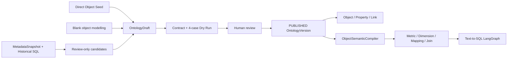

# Data Asset Agents

## Data-source-driven ontology construction

Reviewed YAML remains the Gold ontology, demonstration seed, and compatibility
entry point. The recommended construction path captures `RAW_METADATA` from the
configured PostgreSQL source, generates isolated candidates, requires explicit
human review, promotes a fully reviewed run to an OntologyDraft, and then performs
strict validation, approval, publication, and runtime activation.

`RAW_METADATA` cannot read governed-catalog answers or Gold.
`GOVERNED_CATALOG` additionally permits the independent governed asset catalog.
A Draft carrying `construction_run_id` uses `STRICT_CONSTRUCTION` for validate,
approve, publish, and Dry Run. Its report and READY artifact must record
`seed_accessed=false`, `fallback_used=false`, and
`legacy_ontology_accessed=false`.

Construction Evaluation V2 keeps automatic quality and reviewed quality
separate. `RAW_CANDIDATE` scores immutable generated candidates before any Gold
test-review modification; `REVIEWED_DRAFT` scores the promoted result and reports
review delta, field-level review cost, and an explicit manual-from-zero operation
baseline. Empty comparisons are `null`, never a synthetic 1.0. Business Link
endpoint, direction, semantics, cardinality, and Physical Join consistency are
reported independently. See
[`docs/ontology-construction-evaluation.md`](docs/ontology-construction-evaluation.md)
and [`reports/ontology_construction_v2/`](reports/ontology_construction_v2/).

Fresh isolated database acceptance:

```powershell
$env:GIT_COMMIT_SHA = (git rev-parse HEAD).Trim()
.\scripts\acceptance.ps1 -TimeoutSeconds 600 `
  -ComposeProject "data-asset-agents-local-closure"
```

Existing-Volume upgrade validation preserves legacy data and applies the
repository-allowlisted DDL 009/010 idempotently:

```powershell
$env:GIT_COMMIT_SHA = (git rev-parse HEAD).Trim()
.\scripts\upgrade_acceptance.ps1 -TimeoutSeconds 300 `
  -ComposeProject "data-asset-agents-upgrade-010"
```

For interactive development, run `docker compose up --build -d`; API, Swagger,
and Streamlit are available at <http://localhost:8000>,
<http://localhost:8000/docs>, and <http://localhost:8501>. See
`docs/ontology-construction.md` and
`docs/ontology-construction-evaluation.md` for trust boundaries, reproduction
steps, and the distinction between mock results and unrun live experiments.

Data Asset Agents 是一个面向企业数据资产研发场景的多智能体项目。本分支在稳定的 Text-to-SQL、本体离线构建与安全发布链路上，新增了**认证历史 SQL 资产的结构化管理、混合检索、重排与 SQLGlot AST 模板改写**。当前发布本体仍是在线语义事实源，历史 SQL 只能作为通过安全门槛后的结构模板，不能绕过物理映射、Validator 或 PostgreSQL `EXPLAIN`。

> 安全声明：仓库中的 MiniBank、表结构、业务概念、SQL 和数据均为公开演示目的自行构造，与任何真实机构无关。禁止向本仓库提交真实数据、非公开表结构、非公开 SQL、非公开规则或 API Key。

## MVP 能力

- YAML 人工审核本体；PostgreSQL 运行时语义仓库结构；pgvector 扩展接口
- “自然语言 → 标准业务概念 → 确定性映射 → 表/字段/Join”的选表链路
- 11 节点 LangGraph，可独立运行，也可作为 Subgraph 接入总控 Agent
- 生命周期策略排除 `DEPRECATED`、`TEMPORARY`、`TEST` 资产
- NetworkX 基于审核 Join Graph 规划路径
- SQLGlot 单语句、只读、字段归属、生命周期、审核 Join 和指标过滤校验
- 仅对“缺失必要指标过滤条件”执行确定性修复；不可修复或 SQL 未变化时停止
- PostgreSQL `EXPLAIN` + 只读事务 + 超时 + 最大行数保护
- FastAPI 接口和 Streamlit 汇报页面
- DeepSeek/Qwen OpenAI 兼容客户端配置；无 Key 时默认确定性 mock 模式
- 固定随机种子 `20260715` 生成的纯虚构 MiniBank 数据

## 第二阶段本体构建能力

- PostgreSQL 表、字段、类型、注释、主键、外键和索引抽取
- 行数、空值率、唯一率、最小/最大值、高频值及限量脱敏样例 Profiling
- 表名、Schema 和字段标识符校验；动态查询通过 SQLAlchemy 表达式构建
- SQLGlot 批量解析历史 SQL 的表、字段、Join、过滤、聚合、Group By 和时间字段
- 表共现、字段热度与 Join 使用次数统计，并保存结构化结果
- 基于 LangChain Structured Output 的候选语义生成；mock 模式无 Key 稳定运行
- `CANDIDATE → VERIFIED/REJECTED` 人工审核状态机和不可变审核记录
- PostgreSQL 事务化版本发布，正式概念、指标、维度、属性、映射、Join、表生命周期和规则分表保存
- 在线查询优先读取当前已发布 Physical Mapping；YAML 作为初始化种子和故障回退
- Streamlit 提供元数据、历史 SQL 证据、候选编辑审核和版本发布工作台

## 发布安全与在线语义能力

- `PhysicalMapping.column_bindings` 明确描述语义角色到物理字段的绑定，不再按 `columns` 位置猜测；旧 YAML 可自动迁移
- `OntologyContractValidator` 在发布前检查实际表字段、生命周期、Metric/Dimension 完整性、Join 连通性、候选审核状态和快照一致性
- 发布 Dry Run 会构造候选 Bundle、编译固定基准问题、执行 SQLGlot 校验和 PostgreSQL `EXPLAIN`
- 正式版本通过 `ontology_version_candidate` 保留审核候选来源；Dry Run 失败时不会进入发布事务
- 支持激活或回滚任一已发布版本；切换后同步刷新 OntologyService、QueryExecutor、SQLValidator、概念索引和 LangGraph，并执行健康问题
- mock/live 均输出强类型 Semantic Query；live 使用 LangChain Structured Output，模型只能选择业务语义 ID 或名称
- 低置信度或有歧义的领域问题返回 `clarification_required`，不进入物理资产解析和 SQL 生成
- 当前 `PUBLISHED` 版本的概念、指标、维度、语义属性支持名称、同义词、PostgreSQL 关键词及 pgvector 混合检索
- mock 模式使用固定 1024 维 CPU 哈希向量；live 模式使用配置的 Embedding 客户端

## 对象优先 Ontology Manager

Ontology Manager 在原有分析语义层上增加一层可编辑、可审核的业务对象模型，三层职责明确分离：

- **业务对象模型**：`ObjectType / PropertyDefinition / LinkType` 描述客户、账户、卡、交易、分行和商户，以及对象之间的业务关系。
- **分析语义模型**：`MetricDefinition / DimensionDefinition` 与对象资源进入同一 Draft、审核、Diff、Impact 和版本发布；它们只引用 Property/Dimension ID，物理表达式由 `ObjectSemanticCompiler` 生成。
- **物理实现模型**：`DataSourceDefinition / ObjectDataSourceBinding / PhysicalJoinDefinition` 描述受控 PostgreSQL、属性字段绑定和审核 Join。
- **运行时资产**：不可变 `OntologyVersion` 与版本匹配的 `SQLAssetBuild` 供在线查询读取。



一个业务对象不等于一张表：同一对象可以在后续由多个经过治理的物理来源实现，而汇总表只表达特定粒度的分析结果。`dws_*` 汇总表、`tmp_*`/`test_*` 技术表以及废弃表因此不会自动变成对象。业务 Link（例如 `Transaction belongsTo Branch`）描述业务含义；Physical Join（例如 `dwd_card_transaction.branch_id = dim_branch.branch_id`）只是它的审核物理实现。

字段级 Candidate 仍作为机器证据，不能直接发布；Draft 是一次包含对象、属性、Metric、Dimension、Link、版本化 Physical Join 和绑定的原子变更集。只有 `VALIDATED` Draft 能发布，`DRAFT / IN_REVIEW / REJECTED` 资源与在线查询完全隔离。默认入口直接读取 `ontology/retail_banking/object_model/` 的强类型资源，或从空白 Draft 开始；MetadataSnapshot、字段画像和结构化历史 SQL 只提出带证据的候选，由用户显式选择后才进入 Draft。

### 为什么不再把 Legacy Migration 作为主流程

`LegacyOntologyObjectMigrator` 是仓库从旧 `Metric / Dimension / Mapping` 配置演进到对象模型时的一次性兼容工具。它从旧物理模型反推对象边界，无法替代“人工定义业务对象、程序提供物理证据、人工审核绑定与关系”的建模过程。因此默认 UI、API 演示和 Docker 验收均从直接对象种子或空白 Draft 开始；`migrate-legacy` 只保留在兼容工具区和独立回归测试中。当前发布结果仍由 `ObjectSemanticCompiler` 编译成 `OntologyBundle`，以兼容既有 LangGraph、SQLAsset 与 Evaluation，旧 `Metric.expression/base_table` 和 `Dimension.table/column` 暂作为运行时兼容字段保留。

## 对象运行时与变更治理

完整编译契约、变更生命周期和安全边界见 [`docs/ontology-runtime.md`](docs/ontology-runtime.md)。

- 发布校验动态编译 4 个核心问题（分行信用卡金额/笔数、分行排名、渠道金额、分行活跃客户），逐项返回 Property、Binding、Join、SQLGlot、业务策略与 PostgreSQL `EXPLAIN` 证据。
- Draft Diff 将对象、属性、Metric、Dimension、Link、Binding 和 Physical Join 分类为新增、修改、废弃或删除；Impact 报告列出受影响的分析语义、Join Path、SQLAsset、Benchmark 以及需要重建的索引。
- 删除资源、修改主键/类型/Binding/Physical Join 等 Breaking Change 必须在发布请求中显式确认并填写变更工单；未确认时拒绝发布。
- Metadata Sync 使用只读数据库元数据对比发布时保存的字段、类型、主键和 schema hash，区分 `NONE / ADDITIVE / BREAKING`；Breaking Drift 会阻断后续发布。
- Ontology IndexBuild 按 `ontology_version_id`、资源类型与 embedding 模型留存 `BUILDING / READY / FAILED / STALE` 状态。新 READY 构建原子切换，失败构建不覆盖旧索引。
- Object Explorer 只按当前发布的对象属性白名单生成参数化 `SELECT`，最多返回 100 行；敏感属性脱敏，未知查询参数、任意字段、任意 SQL 和写操作均被拒绝。

## 认证 SQL 资产能力

- `SQLAsset` 保存问题、业务摘要、认证等级、SQLGlot 结构、指标/维度、表字段、Join、CTE、子查询、窗口函数、AST 节点分布与规范化指纹
- 每条资产绑定 `ontology_version_id`、`build_id`、来源哈希、受控来源路径和索引时间，能够追溯到生成它的本体版本与批次
- `SQLAssetBuild` 使用 `BUILDING → READY/FAILED` 状态；在线检索只读取当前本体版本最近的 READY 构建
- 新构建在 READY 前不会替换旧索引，解析、Embedding 或持久化失败只标记该批次 FAILED，旧 READY 构建继续服务
- 离线构建结合当前已发布本体检查 Physical Mapping、字段存在性、表生命周期和审核 Join，并以 PostgreSQL `EXPLAIN` 作为进入召回池的硬门槛
- 业务口径硬门槛校验指标过滤、聚合函数、物理字段角色、时间维度、支持维度、冲突过滤和当前版本 Physical Mapping；失败原因写入 `metric_policy_violations`
- PostgreSQL 同时保存结构化 JSONB、全文索引和 pgvector；mock 使用稳定 CPU 向量，live 复用现有 Embedding 客户端
- 检索仅考虑认证、解析成功、生命周期有效、字段有效、Join 已审核且 EXPLAIN 成功的资产
- 通过自然语言、指标、维度、表字段、Join、AST、认证和生命周期八项分数组合重排，并返回每项得分与证据
- 简单查询继续使用确定性编译器；只有带 CTE、子查询或窗口函数的复杂认证模板才尝试 SQLGlot AST 改写
- 在线节点对 Top-K 逐条执行 `TemplateCompatibilityChecker`，按指标、维度、表字段、Join、结构标签和物理角色选择第一个兼容模板，并返回排名与跳过原因
- 改写通过 SQLValidator 和 PostgreSQL `EXPLAIN` 后才可进入后续执行；任一步失败都会显式记录原因并回退确定性 SQL

重排总分为：自然语言向量/全文 `25%` + 指标 `15%` + 维度 `10%` +
表字段覆盖 `15%` + Join `10%` + AST 标签 `5%` + 认证等级 `10%` +
生命周期 `10%`。该公式不参与硬门槛判定；任一硬门槛失败的资产不会因得分高而返回。

## 可复现对照评测

MiniBank 是冻结于 `2026-07-16` 的完全虚构数据快照。相对时间问题以
`domain.yaml` 中审核过的 `data_reference_date` 为准，而不是运行机器的墙上
日期；因此 Docker、CI 与本地 Gold 结果可重复。其他未声明该字段的数据域仍
使用 PostgreSQL `CURRENT_DATE`。

- `SchemaBaselineStrategy`、`PhysicalRAGStrategy` 和 `OntologyStrategy` 使用统一 `StrategyResult`，但知识源严格隔离。
- Ontology 通过 `sql_asset_enabled` 拆分为 `ontology_no_sql_asset` 与 `ontology_full`，单独测量 SQLAsset/AST 改写贡献。
- 公共只读安全、本体业务策略和隐藏评测审计分别由三个 Validator/Inspector 负责，Schema/RAG 不会被本体规则自动纠正。
- Physical RAG 使用单独的物理文档索引，不复用概念检索、Ontology JoinPlanner 或 SQLAssetService。
- 80 条 MiniBank Benchmark 覆盖指标、维度、Join、时间、IN、Top N、CTE、窗口、子查询、同义词、金额字段歧义、生命周期与澄清/域外问题。
- EvaluationRun 固化模型、版本、Git SHA、数据库快照、RAG/本体/SQLAsset Build 和 Benchmark 版本；每完成一个 Case 立即写库。
- mock 运行标记为 `smoke`，仅验证工程链路；正式效果比较必须使用相同模型配置的 `live` 运行。

完整实验协议、指标公式和知识边界见 [`docs/evaluation.md`](docs/evaluation.md)。

离线与在线边界：

```text
数据库 + 历史 SQL → 元数据快照/结构化证据 → LLM 候选(CANDIDATE)
    → 人工 VERIFIED/REJECTED → 显式发布 OntologyVersion
    → 在线查询只读取当前 PUBLISHED 版本
```

## 核心链路

```text
问题 → 已发布概念混合召回 → 候选约束的 Semantic Query → 正式物理资产
    → Join Graph → 认证 SQL 资产混合检索 → 确定性编译/AST 改写
    → SQLGlot 校验 → EXPLAIN/只读执行 → 解释
```

向量检索只用于业务概念候选和认证历史 SQL 候选，不允许绕过本体映射直接搜索并选择物理表。

## 目录

```text
apps/api/                    FastAPI
apps/web/                    Streamlit
src/data_asset_agents/
  ontology/                  模型、YAML 仓库、发布器与服务
    builder/                 Profiling 证据编排、候选生成与发布服务
    manager/                 对象模型、Draft、迁移、校验、投影与原子发布
    repository/              YAML 种子和 PostgreSQL 审核/版本仓库
  text2sql/                  State、Graph、节点和 Join 工具
  sql_assets/                SQLAsset 解析、存储、混合重排和 AST 改写
  validation/                SQLGlot 安全校验
  execution/                 PostgreSQL 只读执行器
  metadata/                  离线元数据抽取骨架
  evaluation/                隔离策略、Physical RAG、Benchmark、指标、CLI 与持久化
ontology/retail_banking/     人工审核语义定义源
data/ddl/                    MiniBank DDL
data/seed/                   固定种子生成器及生成 SQL
data/historical_sql/         认证历史 SQL 示例
tests/                       核心路径测试
```

## Windows + Docker Desktop 启动

要求：Docker Desktop 已启动，并启用 Docker Compose v2。默认 mock 验收无需本地 Python 和 API Key。

```powershell
git clone https://github.com/BaBaLiBoo/data-asset-agents.git
cd data-asset-agents
git switch feature/text2sql-mvp
Copy-Item .env.example .env
docker compose up --build -d
docker compose ps
```

访问：

- Streamlit：http://localhost:8501
- FastAPI 文档：http://localhost:8000/docs
- 健康检查：http://localhost:8000/health

运行目标用例：

```powershell
$body = @{
  question = "查询近30天各分行信用卡交易金额和交易笔数。"
  query_mode = "ontology"
} | ConvertTo-Json
Invoke-RestMethod -Method Post -Uri http://localhost:8000/api/v1/query `
  -ContentType "application/json" -Body $body
```

停止并保留数据：

```powershell
docker compose down
```

需要重新执行初始化 SQL 时删除纯演示卷：

```powershell
docker compose down -v
docker compose up --build -d
```

如果需要保留已有演示数据，可在更新 Compose 容器后依次执行增量 DDL：

```powershell
docker compose up -d postgres
docker compose exec postgres psql -U minibank -d minibank `
  -f /docker-entrypoint-initdb.d/002_ontology_builder.sql
docker compose exec postgres psql -U minibank -d minibank `
  -f /docker-entrypoint-initdb.d/003_release_safety_and_search.sql
docker compose exec postgres psql -U minibank -d minibank `
  -f /docker-entrypoint-initdb.d/004_sql_assets.sql
docker compose exec postgres psql -U minibank -d minibank `
  -f /docker-entrypoint-initdb.d/005_sql_asset_builds.sql
docker compose exec postgres psql -U minibank -d minibank `
  -f /docker-entrypoint-initdb.d/006_evaluation.sql
docker compose exec postgres psql -U minibank -d minibank `
  -f /docker-entrypoint-initdb.d/006_ontology_manager_core.sql
docker compose exec postgres psql -U minibank -d minibank `
  -f /docker-entrypoint-initdb.d/007_ontology_runtime_governance.sql
docker compose exec postgres psql -U minibank -d minibank `
  -f /docker-entrypoint-initdb.d/008_ontology_analysis_semantics.sql
```

## 本地 Python 开发

```powershell
py -3.11 -m venv .venv
.\.venv\Scripts\Activate.ps1
python -m pip install -e ".[dev]"
ruff check .
pytest
uvicorn apps.api.main:app --reload
```

另开终端启动前端：

```powershell
.\.venv\Scripts\Activate.ps1
streamlit run apps/web/app.py
```

如需重新生成固定种子数据：

```powershell
python data/seed/generate_seed.py
```

## mock / live 配置

Docker Compose 使用环境变量把 `.env` 配置传入容器，不再强制覆盖 `LLM_MODE`。
模型配置带安全默认值；本地隔离的 PostgreSQL 容器使用 trust 认证，应用通过
`DATABASE_HOST/PORT/NAME/USER` 组件连接，不在仓库或日志中保存口令化连接串。
部署到非本地环境时，应由部署平台通过 Secret 注入认证配置。默认模型配置如下：

```dotenv
LLM_MODE=mock
LLM_API_KEY=
EMBEDDING_API_KEY=
```

此时目标演示问题完全依赖审核本体和确定性规则，不调用外部模型。切换 OpenAI 兼容客户端配置时修改本地 `.env`：

```dotenv
LLM_MODE=live
LLM_PROVIDER=deepseek
LLM_MODEL=deepseek-chat
LLM_BASE_URL=https://api.deepseek.com
LLM_API_KEY=your-key

EMBEDDING_PROVIDER=aliyun
EMBEDDING_MODEL=text-embedding-v4
EMBEDDING_BASE_URL=https://dashscope.aliyuncs.com/compatible-mode/v1
EMBEDDING_API_KEY=your-key
```

业务代码只依赖 LangChain 的 OpenAI 兼容适配器。`.env` 已被 Git 忽略，仓库只保留无密钥的 `.env.example`。

`LLM_MODE=live` 会启用在线 Semantic Query Structured Output 和离线候选生成；SQL 仍由已发布本体确定性编译，不允许模型输出物理表、字段或 SQL。系统不具备任意问题生成能力；域外问题返回 `unsupported`，有业务相关词但含义不足的问题返回 `clarification_required`。

第二阶段在 `LLM_MODE=live` 时通过现有 `ModelFactory` 创建 OpenAI 兼容 Chat Model，并使用 `with_structured_output` 生成候选语义；输出仍是 `CANDIDATE`，必须人工审核和显式发布。mock 模式使用确定性规则生成同结构候选，不需要 API Key。

## 主要 API

| 方法 | 路径 | 说明 |
|---|---|---|
| GET | `/health` | API 与数据库健康状态 |
| POST | `/api/v1/query` | 执行完整 LangGraph |
| POST | `/api/v1/semantic/parse` | 仅解析 Semantic Query |
| POST | `/api/v1/semantic/search` | 搜索标准业务概念 |
| POST | `/api/v1/semantic/resolve` | 确定性解析表、字段与规则 |
| GET | `/api/v1/ontology/concepts` | 查看业务概念 |
| GET | `/api/v1/ontology/metrics` | 查看指标口径 |
| GET | `/api/v1/ontology/tables` | 查看表资产与生命周期 |
| POST | `/api/v1/sql-assets/build` | 批量解析、校验、EXPLAIN 并索引受控历史 SQL |
| GET | `/api/v1/sql-assets` | 查看全部 SQL 资产及安全状态 |
| POST | `/api/v1/sql-assets/search` | 按语义与结构混合检索认证 SQL |
| GET | `/api/v1/sql-assets/{id}` | 查看 SQL 资产结构化详情 |
| POST | `/api/v1/ontology/build` | 抽取物理知识、解析历史 SQL 并生成候选 |
| GET | `/api/v1/ontology/candidates` | 按类型和状态查看候选 |
| GET | `/api/v1/ontology/candidates/{id}` | 查看候选及证据 |
| POST | `/api/v1/ontology/candidates/{id}/verify` | 编辑并审核通过候选 |
| POST | `/api/v1/ontology/candidates/{id}/reject` | 拒绝候选 |
| POST | `/api/v1/ontology/publish` | 将已审核内容发布为正式版本 |
| POST | `/api/v1/ontology/publish/validate` | 发布 Dry Run：契约、SQLGlot、EXPLAIN |
| GET | `/api/v1/ontology/versions` | 查看正式本体版本 |
| POST | `/api/v1/ontology/versions/{version}/activate` | 激活或回滚已发布版本 |
| POST/GET | `/api/v1/ontology/drafts` | 创建或列出对象模型 Draft |
| POST | `/api/v1/ontology/drafts/from-seed` | 从允许列表中的直接对象种子创建 Draft |
| GET/DELETE | `/api/v1/ontology/drafts/{draft_id}` | 查看或删除未发布 Draft |
| POST/PUT/DELETE | `/api/v1/ontology/drafts/{draft_id}/object-types` | 编辑 Draft 对象类型 |
| POST/PUT/DELETE | `/api/v1/ontology/drafts/{draft_id}/properties` | 编辑 Draft 属性 |
| POST/PUT/DELETE | `/api/v1/ontology/drafts/{draft_id}/link-types` | 编辑 Draft 业务 Link |
| POST/PUT/DELETE | `/api/v1/ontology/drafts/{draft_id}/physical-joins` | 编辑版本化审核 Physical Join |
| POST/PUT | `/api/v1/ontology/drafts/{draft_id}/bindings` | 编辑对象物理绑定 |
| POST | `/api/v1/ontology/drafts/{draft_id}/candidates/generate` | 从固定 Snapshot 与历史 SQL 生成对象候选 |
| POST | `/api/v1/ontology/drafts/{draft_id}/import-candidates` | 显式选择候选并导入 Draft |
| GET | `/api/v1/ontology/drafts/{draft_id}/diff` | 计算 Draft 结构化变更集合 |
| GET | `/api/v1/ontology/drafts/{draft_id}/impact` | 计算下游影响与 Breaking Change |
| POST | `/api/v1/ontology/drafts/migrate-legacy` | 兼容接口：幂等迁移旧审核 YAML 到 Draft |
| POST | `/api/v1/ontology/drafts/{draft_id}/validate` | 运行对象、物理、投影、SQLGlot 与 EXPLAIN 校验 |
| POST | `/api/v1/ontology/drafts/{draft_id}/submit` | 提交审核并锁定编辑 |
| POST | `/api/v1/ontology/drafts/{draft_id}/approve` | 审核并进入 VALIDATED |
| POST | `/api/v1/ontology/drafts/{draft_id}/reject` | 拒绝 Draft |
| POST | `/api/v1/ontology/drafts/{draft_id}/publish` | 原子发布对象资源并刷新在线运行时 |
| GET | `/api/v1/ontology/object-types` | 当前正式对象类型 |
| GET | `/api/v1/ontology/link-types` | 当前正式业务 Link |
| GET | `/api/v1/ontology/object-graph` | 当前正式对象图 |
| GET/POST | `/api/v1/ontology/data-sources` | 查看并检查受控数据源（不返回 Secret） |
| POST/GET | `/api/v1/ontology/sync-runs` | 运行或查看 Metadata Sync |
| GET | `/api/v1/ontology/drift` | 查看版本化 Schema Drift 报告 |
| POST/GET | `/api/v1/ontology/index-builds` | 构建或查看版本化本体检索索引 |
| GET | `/api/v1/objects/{object_type}` | 安全列出发布对象，支持白名单过滤 |
| GET | `/api/v1/objects/{object_type}/{id}` | 读取发布对象详情 |
| GET | `/api/v1/objects/{object_type}/{id}/links/{link}` | 沿审核 Link 只读导航 |
| GET | `/api/v1/graph` | 查看节点与边 |
| POST | `/api/v1/evaluation/runs` | 创建异步 smoke/live 评测运行 |
| GET | `/api/v1/evaluation/runs` | 查看评测运行与可复现元数据 |
| GET | `/api/v1/evaluation/runs/{run_id}` | 查看运行状态和指标 |
| GET | `/api/v1/evaluation/runs/{run_id}/cases` | 查看逐案例结果与 Gold 快照 |
| GET | `/api/v1/evaluation/compare` | 公平性校验后对比多个运行 |
| GET | `/api/v1/evaluation/runs/{run_id}/export` | 导出 JSON 或 CSV |

不支持问题的响应示例：

```json
{
  "status": "unsupported",
  "error_code": "UNSUPPORTED_QUERY",
  "detail": "未识别到第一阶段本体支持的业务指标"
}
```

## 完整验收

Windows PowerShell 一键验收脚本会校验 Compose、构建并启动容器、等待健康检查、调用目标查询、检查非空结果、输出容器状态，并在结束或失败后执行 `docker compose down`：

```powershell
Copy-Item .env.example .env
.\scripts\acceptance.ps1
.\scripts\upgrade_acceptance.ps1
```

Fresh 与 Upgrade 验收默认使用独立宿主端口（分别为
`15432/18000/18501` 和 `25432/28000`），因此可以与普通开发环境的
`5432/8000/8501` 同时运行；也可通过脚本端口参数覆盖。

手工执行等价步骤：

```powershell
docker compose config --quiet
docker compose up --build -d
Invoke-RestMethod http://localhost:8000/health

$body = @{
  question = "查询近30天各分行信用卡交易金额和交易笔数。"
  query_mode = "ontology"
} | ConvertTo-Json
Invoke-RestMethod -Method Post -Uri http://localhost:8000/api/v1/query `
  -ContentType "application/json; charset=utf-8" -Body $body

docker compose ps
docker compose down
```

脚本还会执行真实复杂模板问题“查询近30天各分行信用卡交易金额和排名”，并断言：召回认证模板、`sql_rewrite.used_template=true`、SQL 保留 `WITH` 和 `DENSE_RANK`、SQLValidator/EXPLAIN 通过且结果非空。

同一验收先抽取 MetadataSnapshot，再从直接对象种子创建 Draft，核对 `Transaction.amount` 的物理绑定和 Transaction → Branch Link；随后生成带 Profile/历史 SQL 证据的候选，确认汇总、技术和废弃表被排除，人工验证并选择至少一个候选导入。验收继续检查 Diff/Impact、4 个动态 Dry Run、审核和原子发布，最后构建版本化概念索引、执行 Metadata Sync、验证 Object Explorer 的脱敏与 Link 导航，并运行上述两个 Text-to-SQL 回归问题。默认验收不调用 Legacy migrator。

代码检查：

```powershell
py -3.11 -m venv .venv
.\.venv\Scripts\Activate.ps1
python -m pip install -e ".[dev]"
ruff check .
pytest
```

真实 PostgreSQL 集成测试由 GitHub Actions 自动初始化 pgvector PostgreSQL、执行 DDL 和 Seed，并设置 `RUN_POSTGRES_INTEGRATION=1`。本地运行集成测试时，应先启动并初始化 Docker 数据库，再设置相同环境变量。

## 本体构建、审核与发布

打开 Streamlit 后，在左侧“工作台”切换到“本体构建与审核”。标准操作顺序：

1. 开始离线构建，查看元数据快照、字段统计、脱敏样例和历史 SQL 证据。
2. 分别审核 Concept、Mapping 和 Join 候选；可编辑业务名称、语义属性和同义词。
3. 只有所选元数据快照中的 `VERIFIED` 候选具备发布资格；不同快照的审核结果不会混入同一版本，`CANDIDATE` 和 `REJECTED` 永远不会被在线查询读取。
4. 先执行 Dry Run；只有契约、SQLGlot 和 PostgreSQL `EXPLAIN` 全部通过才能正式发布。
5. 发布或回滚后，API 切换当前版本，重建概念向量索引、Validator 和 Text-to-SQL Graph，并运行基础健康问题。

以下旧脚本仅用于把 YAML 种子概念同步到兼容表，不等同于第二阶段版本发布：

容器启动后，可把审核后的概念写入 PostgreSQL 运行时表：

```powershell
docker compose exec api python scripts/publish_ontology.py
```

YAML 是初始化种子和故障回退；在线事实源是 PostgreSQL 中当前 `PUBLISHED` 的 `OntologyVersion`。

## Ontology Manager 标准演示

打开 Streamlit 左侧独立的“Ontology Manager”工作台。默认流程是“从对象种子创建（或空白 Draft）→ 绑定 MetadataSnapshot → 生成并查看候选证据 → 显式选择导入 → 编辑对象/属性/Binding/Link/Physical Join → Validate 与 Dynamic Dry Run → Diff/Impact → Submit → Approve → Publish”。页面显示属性绑定覆盖率、Schema Sync 状态，并严格区分业务 Link 与 Physical Join。人负责对象边界和最终审核，程序负责元数据/历史 SQL 证据，LLM 只辅助名称、描述和置信度，不能决定正式绑定、Join、生命周期或发布状态。

以下命令只用于旧配置兼容；迁移 Dry Run 不写数据库，也不是默认演示入口：

```powershell
python -m data_asset_agents.ontology.manager.cli migrate-legacy --dry-run `
  --created-by demo --draft-name "MiniBank object model"
```

数据库迁移 `data/ddl/006_ontology_manager_core.sql` 新增 Draft 与 published 资源表以及 `ontology_version_object_resource` 来源关联；`data/ddl/007_ontology_runtime_governance.sql` 新增版本化 Physical Join、ChangeSet/Impact、Sync/Drift 和 Ontology IndexBuild/Search Document 表；`data/ddl/008_ontology_analysis_semantics.sql` 新增 Draft/Published Metric 与 Dimension 资源表；`data/ddl/009_ontology_release_governance.sql` 新增 Draft revision/hash、不可变 CompiledArtifact、append-only Audit Event，以及 IndexBuild/SQLAssetBuild 的 bundle hash 绑定。DDL 使用 `IF NOT EXISTS` 和安全 `ALTER`，新卷由 Compose 自动加载；已有演示卷按编号依次执行。删除 Draft 只级联 Draft 资源，不会删除任何正式版本。

所有初始化和手工升级入口使用同一顺序：`001_schema` → `002_ontology_builder` →
`003_release_safety_and_search` → `004_sql_assets` → `005_sql_asset_builds` →
`006_evaluation` → `006_ontology_manager_core` → `007_ontology_runtime_governance` →
`008_ontology_analysis_semantics` → `009_ontology_release_governance` → `002_seed`。已有数据库
只补执行尚未应用的后续 DDL，不重新执行 Seed；`upgrade_acceptance.ps1` 会构造只到 008 的
独立旧卷、应用 009 两次验证幂等性，并自动清理，绝不连接或修改生产数据库。

Draft 编辑请求必须携带 `If-Match: "<resource_revision>"`（或 `X-Draft-Revision`）。一次用户操作只产生一次 revision；资源修改会统一把旧校验置为 `STALE`。只有最新 revision/hash 已通过 Validator 与四问题 Dynamic Dry Run 才能 Submit，审核由 submitted revision/hash 锁定。新发布版本从 READY CompiledArtifact 启动和回滚，不依赖未来编译器重新计算；旧版本没有 artifact 时才进入只读兼容回退。完整规则见 `docs/ontology-runtime.md`。

## 当前完成状态

已实现：

- Object-first Ontology：Object、Property、Metric、Dimension、Binding、Business Link 与 Physical Join。
- Draft Governance：revision/hash、乐观并发、精确校验快照、Submit/Approve/Publish、Diff/Impact/Drift 和 append-only Audit。
- Runtime Governance：不可变 Compiled Artifact、Hash 校验、启动回退、激活与回滚。
- Text-to-SQL：强类型 Semantic Query、Ontology Retrieval、确定性映射/Join、SQLGlot、安全策略、EXPLAIN、只读执行和修复闭环。
- SQLAsset：版本化 Build、生命周期和业务口径硬门槛、混合检索、重排及受控 CTE/Window AST Rewrite。
- Evaluation Framework：四组隔离 Strategy、80-case 虚构 Benchmark、Gold Result Hash、可复现 Run Manifest 和强制公平性比较。

验证状态按证据区分：

| 项目 | 当前状态 |
|---|---|
| `ruff check .` | GitHub Actions Run #30009633789 通过 |
| `pytest` | Run #30009633789 通过；184 passed，5 skipped，4 warnings |
| Benchmark | 80 cases valid；generator 重跑后文件哈希不变 |
| Gold Hash | `materialize_benchmark_hashes.py --check` 通过 |
| Fresh Compose Acceptance | Run #30009633789 通过；15/15 |
| Upgrade Acceptance | Run #30009633789 通过；10/10，含 DDL 009 二次幂等执行 |
| Published Ontology | `version_f906ab4cf5164742b44ddcb29c02ac54` |
| Compiled Artifact | READY，bundle `0dd064baa8a7…` |
| Ontology Index | READY，`ontology-index-2339b1a35f274d88b1bcd092411dd6c6` |
| SQLAsset Build | READY，`sqlbuild-39aa7df587884846ba05bb33e85810ec` |
| Live Evaluation | 已完成四组各 80 Case，compare `warnings=[]` |

## 实验结果

固定 SHA `705b017f00b0526cd244ab117ebe8cd02dfc03e7` 的四组 Live Result
Accuracy 为：Schema 1.35%、Physical RAG 41.89%、Ontology No SQLAsset 86.49%、
Ontology Full 91.89%。Ontology Full 真实采用 4 个复杂 CTE + Window 模板，
Template Adoption Rate 为 22.22%；同时平均延迟比 No SQLAsset 增加 440.93 ms，
并保留了 1 个 Provider Structured Output 解析错误。

这些数字来自单次 80-case Benchmark，没有重复实验或统计检验。完整配置、分类指标、
错误分布、SQLAsset 采用与边界见
[`docs/evaluation-results.md`](docs/evaluation-results.md)，公平性清单见
[`docs/evaluation-checklist.md`](docs/evaluation-checklist.md)，逐案例产物见
[`artifacts/evaluation/705b017f00b0526cd244ab117ebe8cd02dfc03e7/`](artifacts/evaluation/705b017f00b0526cd244ab117ebe8cd02dfc03e7/)。

## 当前边界

- 仅保证已发布指标、维度及其同义表达的闭环；域外问题返回 unsupported，低置信度问题要求澄清，不会生成占位 SQL。
- `schema`、`rag` 和 `ontology` 已使用独立 Strategy；mock smoke 只能证明隔离与工程可运行，不能代表 live 模型效果。
- 概念向量只匹配当前发布的标准业务语义，绝不直接选择物理表；SQL 资产向量只召回已认证模板，物理表仍由本体映射确定。
- AST 改写支持受控的表/字段角色映射、外层时间与筛选条件、Group By、Order By、Limit，并保留模板中的 CTE、子查询和窗口表达式；跨事实表、相关子查询语义迁移和任意结构合成不在本轮范围内。
- 表映射必须由相同业务概念的 Physical Mapping 证明，不再按表位置猜测；复杂模板 Join 与目标 Join 不一致时直接回退，只有简单结构可以从确定性 SQL AST 安全重建 FROM/JOIN。
- API 启动优先复用当前本体版本最近 READY 构建；仅在 mock 且没有 READY 构建时初始化一次。live 模式不会因 Embedding 服务不可用而阻塞 API 启动。
- 受控样本当前为 20 条纯虚构 SQL，覆盖聚合、多维 Group By、Top N、CTE、窗口、子查询、时间、IN 及生命周期/口径/Join/认证/EXPLAIN 反例。
- SQL 资产认证状态由受控源文件提供；本轮没有实现多人签名认证工作流，也没有增量 CDC 或异步构建队列。
- 本轮实现的是受控离线构建，不是无人值守的“自动本体”：业务骨架仍来自人工定义，LLM 只生成候选，发布必须人工审核。
- 自动修复仅支持补齐校验器明确指出的必要指标过滤条件；字段错误、未审核 Join、禁用表和数据库执行错误不会被猜测性修改。
- 已实现版本激活、回滚和可复现评测；尚未实现细粒度权限、多人审批、版本签名和分布式评测队列。
- 本轮已实现 schema/rag/ontology 四组严格隔离对照；尚不实现多事实表 SQL、历史 SQL 自由 AST 合成、复杂 LLM SQL 修复、OWL/RDF/SPARQL/Neo4j 或其他 Agent。
## Ontology Construction Quality V2

原始候选质量和审核后 Draft 质量现已分开评测，并单独统计审核增益、字段级审核成本和人工从零建模成本估算。空集合不再显示虚假的 100%；业务 Link 同时报告无向端点、方向、语义名称/稳定 ID 和 Physical Join 一致性。

真实 PostgreSQL 中已发布三个相互隔离的版本：

- O-C Reviewed：`version_9792e7e2f4fa4db9b27cb26a3c076f2c`
- O-D Reviewed：`version_23aa2974a54a460694a92024b3d0b1a9`
- Gold：`version_3a17072aa48949f185d167da1e1892e8`

三者的 bundle、artifact source hash 和 READY SQLAsset Build 均不同。O-C/O-D 通过严格构建且三个泄漏标志均为 `false`。第一次保留全部允许语义字段的 O-D Draft 被 PostgreSQL Dry Run 拒绝，没有发布；正式 O-D 对照版本只保留模型生成的对象边界说明，并明确记录为查询安全的测试审核策略。

T-A 至 T-H 共 640 Case 的正式 live 实验尚未运行。它需要把虚构 MiniBank 问题、本体语义和检索文本发送到配置的 DeepSeek 与 DashScope 服务；本次执行未获得该外发载荷的明确授权，因此没有生成或伪造 Case 结果。完整版本、Hash、构建 ID 和未运行原因见 `reports/ontology_construction_v2/published_versions_v2.json` 与 `reports/text2sql_reviewed_ontology_v2/manifest.json`。

本地 Fresh Acceptance 和 Existing-Volume Upgrade Acceptance 均已实际通过。随后在最终 SHA 上复跑 Fresh 时，Docker Desktop 本地内容存储读取 `pgvector` 镜像 blob 出现 I/O 错误；验收脚本已按预期立即失败并清理临时项目，但 Docker Linux Engine 重启未恢复。该外部故障没有记作通过，详情见 `reports/ontology_construction_v2/local_runtime_verification_v2.json`。

- Ontology Manager 当前只连接应用已经配置的 PostgreSQL Engine；`connection_ref` 仅保存环境变量名，不支持 API 任意新增主机。
- `account.status` 与 `card.status` 已作为对象属性保留，但当前虚构物理表没有对应字段，因此不会伪造物理绑定或进入运行时投影。
- Object Explorer 仅支持单对象白名单筛选和审核 Link 导航，不提供自由查询语言、任意排序、导出、写回或细粒度用户权限。
- Metadata Drift 是按需只读检查，不是 CDC；索引构建第一版同步执行，不含异步队列、增量分片和跨数据库连接。
- 本轮未实现 ActionType、写回 Function、SharedProperty、Interface、行列权限、Automate 或多数据库动态接入。
