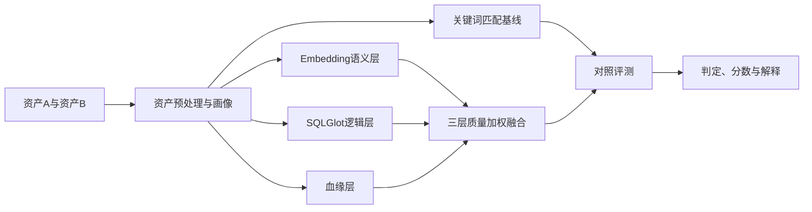

# task1_v1 技术设计（评审版）

> 本文用于技术评审，描述Task1的三层判重模型、接口和工程边界。

版本：V0.2  
状态：已评审，按7项推荐方案实施  
目标：比较“传统关键词匹配”与“语义+逻辑+血缘三层模型”的资产去重效果

## 1. 文档目的

本文档用于确定新 Demo 的范围、数据契约、算法口径、接口、评测方法和验收标准。评审通过后再按本文档编码，避免继续在旧 Demo 上叠加功能。

本阶段严格围绕课题原始要求：

> 语义层依托 Embedding 向量化技术识别语义重复；逻辑层结合 SQL 解析技术比对计算逻辑；血缘层追溯资产同源关系；通过三维融合识别冗余资产，并与传统关键词匹配方法进行对比。

## 2. 本阶段范围

### 2.1 必须实现

1. 关键词匹配基线。
2. Embedding 语义相似度。
3. SQLGlot SQL 逻辑相似度。
4. 数据血缘相似度。
5. 三层质量加权融合。
6. 两种模式使用同一批数据进行对照评测。
7. FastAPI 比较接口和可解释结果。
8. 小规模、容易阅读的 Demo 案例。

### 2.2 暂不实现

- 本体概念归一化和本体规则推理；
- Agent、子代理和大模型自主决策；
- 向量数据库和大规模候选检索；
- 资产自动删除、下线或生产 SQL 执行；
- 完整银行级指标口径平台；
- 复杂人工标注平台。

本体只能作为后续独立增强实验，不能进入本阶段三层主链路。

## 3. 资产去重发生在什么场景

Demo 支持两个入口，但首期重点实现资产两两比较。

### 3.1 新资产准入检查

开发人员提交一个拟新增资产，系统将其与已有资产比较，提示是否可能重复。

### 3.2 存量资产治理

定期对存量资产进行批量比较，形成疑似重复清单，交由治理人员确认。

系统只提供判定依据，不自动删除资产。

## 4. 总体架构



系统只包含两种实验模式：

```text
KEYWORD_BASELINE
THREE_LAYER
```

这样能够直接回答课题最核心的问题：三层模型是否优于传统关键词匹配。

## 5. 输入数据契约

所有比较使用统一的 `AssetInput`，避免两种方法使用不同信息。

```json
{
  "asset_id": "ADS_DEPOSIT_001",
  "asset_name": "个人客户月日均存款",
  "description": "按客户和月份统计人民币存款自然日日均余额",
  "business_domain": "deposit",
  "sql_text": "SELECT ...",
  "sql_dialect": "spark",
  "declared_grain": ["customer", "month"],
  "metric_name": "月日均存款",
  "metric_definition": "每日账户日终余额合计除以自然日天数",
  "tables": [
    {
      "name": "dwd_account_daily_balance",
      "cn_name": "账户日余额明细",
      "columns": [
        {
          "name": "customer_id",
          "cn_name": "客户编号",
          "comment": "统一客户编号",
          "data_type": "STRING",
          "role": "dimension"
        }
      ]
    }
  ],
  "lineage": {
    "direct_upstreams": ["dwd_account_daily_balance"],
    "root_sources": ["m_savings_account", "m_savings_account_transaction"],
    "column_signatures": [
      "avg_balance<-dwd_account_daily_balance.end_balance"
    ],
    "coverage": 0.9,
    "freshness": 1.0,
    "source_reliability": 0.9
  }
}
```

首期必填字段：

```text
asset_id
asset_name
description
business_domain
sql_text
sql_dialect
declared_grain
tables
lineage.direct_upstreams
```

其他字段允许缺失，但缺失信息必须降低对应层的质量系数，不能默认为完全一致。

## 6. 关键词匹配基线

关键词基线只进行字面匹配，不使用 Embedding、SQL AST 和血缘。

### 6.1 文本标准化

1. 英文转小写。
2. 下划线、连字符和驼峰命名拆分。
3. 去除标点和多余空格。
4. 中文使用分词；英文按标识符和单词切分。
5. 去除通用停用词，但不维护业务同义词表。

### 6.2 计算公式

每部分使用关键词集合 Jaccard：

```text
Jaccard(A,B) = |A∩B| / |A∪B|
```

基线分数：

```text
KeywordSim =
    0.35 × NameKeywordSim
  + 0.25 × DescriptionKeywordSim
  + 0.25 × FieldKeywordSim
  + 0.15 × TableKeywordSim
```

缺失部分不计入分母，剩余权重重新归一化。

该模式代表传统“名称、描述、表字段关键词重合度”方案。

## 7. 语义层

### 7.1 方法

语义层使用由部署环境配置的在线Embedding模型，不在业务代码中固定模型名称和向量维度。不提供 TF-IDF、Sentence Transformer 或其他静默回退实现。当前内置客户端支持OpenAI兼容的`POST /embeddings`协议，分别向量化以下文本块，再计算余弦相似度：

```text
名称文本：asset_name
业务文本：description + metric_name + metric_definition
Schema文本：表名、表中文名、字段名、字段中文名和注释
粒度文本：business_domain + declared_grain
```

### 7.2 计算公式

```text
SemanticSim =
    0.30 × NameEmbeddingSim
  + 0.35 × BusinessEmbeddingSim
  + 0.25 × SchemaEmbeddingSim
  + 0.10 × GrainEmbeddingSim
```

其中：

```text
EmbeddingSim = Cosine(vectorA, vectorB)
```

缺失文本块不计入分母，剩余权重重新归一化。

### 7.3 缓存

以以下内容计算缓存键：

```text
SHA256(base_url_hash + model + dimension + normalized_text)
```

向量存入 SQLite，避免重复调用在线 Embedding API。API 调用失败时必须返回明确错误，评测模式禁止静默回退到关键词算法。

本阶段不加入任何本体概念、同义词映射或 LLM 改写。

### 7.4 API配置

项目通过进程环境变量或本地 `.env` 读取 Embedding 服务配置：

```text
EMBEDDING_API_KEY=<部署环境提供的API Key>
EMBEDDING_BASE_URL=<OpenAI兼容服务地址>
EMBEDDING_MODEL=<模型名称>
EMBEDDING_DIMENSION=<模型输出向量维度>
EMBEDDING_SEND_DIMENSIONS=<true或false>
EMBEDDING_API_KEY_HEADER=<默认Authorization>
EMBEDDING_API_KEY_PREFIX=<默认Bearer>
```

`.env` 必须加入 `.gitignore`，不得提交到代码仓库。`run.ps1`、`test.ps1` 和评测脚本自动加载该文件；总控部署时也可以直接设置进程环境变量。如果缺少必要配置，程序直接报错终止，不允许切换为其他语义算法。

模型和维度由部署方选择，但必须与服务实际返回一致。更换服务、模型或维度后，
缓存命名空间自动变化，且必须重新执行DEV阈值校准。API Key不得通过Task1业务请求传递。

## 8. 逻辑层

### 8.1 SQL 解析

使用 SQLGlot 按 `sql_dialect` 解析 SQL，生成 AST 和逻辑指纹。

首期标准化包括：

1. 忽略大小写、空格和换行差异。
2. 统一表别名和字段限定名。
3. 展开只读 CTE 和无业务作用的外层包装。
4. 对 AND 条件排序。
5. 对 IN 常量集合排序。
6. 将日期、金额、字符串、数字和参数归为常量类别。
7. 统一等价的字段别名表达。
8. 保留聚合函数、过滤字段、分组字段和 JOIN 条件差异。

### 8.2 逻辑指纹

```text
InputSignature       输入表集合
ProjectionSignature 投影表达式集合
JoinSignature       JOIN类型与连接字段
PredicateSignature  过滤字段、运算符、值类别、布尔结构
GroupAggSignature   GROUP BY、聚合函数和聚合字段
StructureSignature  SELECT/JOIN/WHERE/GROUP等结构节点
```

### 8.3 计算公式

```text
LogicSim =
    0.15 × InputSim
  + 0.20 × ProjectionSim
  + 0.15 × JoinSim
  + 0.20 × PredicateSim
  + 0.20 × GroupAggSim
  + 0.10 × StructureSim
```

集合类特征使用 Jaccard，表达式签名使用多重集合 Jaccard。

首期 `PredicateSim` 不做复杂日期区间交并比，只采用：

```text
同字段、同运算符、同标准化值：1.0
同字段、同运算符、同值类别：0.5
参数值无法静态确定：该子项不可用
字段或运算符不同：0.0
```

SQL 解析失败时逻辑层标记为不可用，并输出错误信息，不能返回 0 分冒充“不相似”。

## 9. 血缘层

### 9.1 比较内容

```text
DirectUpstreamSim：直接上游表集合 Jaccard
RootSourceSim：根源表集合 Jaccard
ColumnLineageSim：字段依赖签名集合 Jaccard
```

### 9.2 计算公式

```text
LineageSim =
    0.30 × DirectUpstreamSim
  + 0.50 × RootSourceSim
  + 0.20 × ColumnLineageSim
```

字段血缘缺失时不直接记 0，而是去除该子项并重新归一化，同时降低血缘质量系数。

### 9.3 血缘质量

单个资产血缘质量：

```text
LineageQuality =
    0.50 × Coverage
  + 0.30 × Freshness
  + 0.20 × SourceReliability
```

资产对质量：

```text
PairLineageQuality = min(LineageQualityA, LineageQualityB)
```

公开 Schema 仿真环境中根源表数量有限，因此血缘层只作为三层证据之一，不能单独判定重复。

## 10. 三层融合

初始层权重：

```text
语义层：0.40
逻辑层：0.40
血缘层：0.20
```

质量加权融合：

```text
FusionSim =
  Σ(LayerWeight × LayerQuality × LayerSim)
  / Σ(LayerWeight × LayerQuality)
```

证据覆盖率：

```text
EvidenceCoverage = Σ(可用层的LayerWeight × LayerQuality)
```

初始判定阈值：

```text
FusionSim >= 0.88 且 EvidenceCoverage >= 0.70
→ DUPLICATE

FusionSim >= 0.75
→ SUSPECTED_DUPLICATE

其他
→ NOT_DUPLICATE
```

这些值只是编码初始值。正式阈值必须只在 DEV 集上选择，TEST 集禁止参与调参。

## 11. 对照实验设计

### 11.1 对比模式

```text
实验A：KEYWORD_BASELINE
实验B：THREE_LAYER
```

两种模式必须使用：

- 完全相同的资产对；
- 完全相同的 DEV/TEST 切分；
- 完全相同的标准标签；
- 相同的评测脚本和指标定义。

两种模式可以分别在 DEV 上选择最佳阈值，但不能使用 TEST 调参。

### 11.2 首期数据规模

为保持 Demo 简单，首期使用 60 对样本：

```text
重复：20对
非重复但高度相似：20对
明显不相似：20对

DEV：40对
TEST：20对
```

同一基础资产产生的变体必须全部进入同一个数据分区，避免数据泄漏。

数据文件采用引用式结构：

```text
data/assets.jsonl
每个资产只保存一次

data/pairs.csv
只保存pair_id、asset_a_id、asset_b_id、label、scenario、split

data/demo_cases.json
保存10～12个可直接展示的典型案例
```

不再把两个完整资产重复嵌入每一行评测数据。

### 11.3 场景覆盖

必须覆盖：

1. 名称不同但含义相同。
2. SQL 只有格式差异。
3. 表别名和字段别名不同。
4. AND 条件顺序不同。
5. CTE 等价包装。
6. 聚合函数不同。
7. 分组粒度不同。
8. 过滤范围不同。
9. 上游相同但加工逻辑不同。
10. 逻辑相同但上游来源不同。
11. 字段血缘缺失。
12. 完全不同业务域。

## 12. 评测指标

主要指标：

```text
Precision：判为重复的资产中有多少真正重复
Recall：真实重复资产中有多少被自动识别
F1：Precision和Recall的综合指标
False Positive Rate：错误合并风险
Candidate Recall：重复资产进入自动重复或疑似重复范围的比例
Review Rate：需要人工确认的比例
Latency：单次比较耗时
```

课题中的“准确率不低于 90%”必须在评审时明确究竟指 Accuracy、Precision 还是其他指标。资产去重涉及错误下线风险，建议以重复类 Precision 为主指标，同时报告 Recall 和 F1。

公开 Schema 半仿真数据只能用于工程预评测，不能直接证明真实银行生产准确率达到 90%。

## 13. API设计

### 13.1 健康检查

```http
GET /health
```

### 13.2 资产两两比较

```http
POST /api/v1/task1/compare
```

请求：

```json
{
  "mode": "THREE_LAYER",
  "asset_a": {},
  "asset_b": {}
}
```

响应：

```json
{
  "decision": "SUSPECTED_DUPLICATE",
  "keyword_score": null,
  "semantic_score": 0.91,
  "logic_score": 0.87,
  "lineage_score": 0.95,
  "fusion_score": 0.90,
  "evidence_coverage": 0.86,
  "warnings": [],
  "explanation": [
    "业务描述语义高度相似",
    "SQL投影、过滤和聚合结构接近",
    "直接上游和根源表一致"
  ]
}
```

关键词模式只返回 `keyword_score`，三层分数字段为 `null`，防止两个实验相互污染。

## 14. 项目结构

```text
task1_v1/
├── app/
│   ├── api.py
│   ├── config.py
│   ├── models.py
│   ├── keyword.py
│   ├── semantic.py
│   ├── sql_logic.py
│   ├── lineage.py
│   ├── fusion.py
│   └── service.py
├── data/
│   ├── assets.jsonl
│   ├── pairs.csv
│   └── demo_cases.json
├── scripts/
│   ├── build_dataset.py
│   └── evaluate.py
├── tests/
├── reports/
├── requirements.txt
├── run.ps1
├── test.ps1
└── README.md
```

## 15. 外部依赖

```text
FastAPI             HTTP服务
Pydantic            输入输出校验
SQLGlot             SQL解析和标准化
httpx               在线Embedding API调用
python-dotenv        加载本地Embedding配置
jieba               中文关键词分词
NumPy               余弦相似度
SQLite              资产和Embedding缓存
pytest              自动测试
```

唯一必须联网的算法依赖是在线 Embedding API。关键词、SQL、血缘和融合计算均在本地完成。

## 16. 测试要求

### 16.1 单元测试

- 关键词标准化和 Jaccard 计算；
- 在线服务返回向量的维度校验、缓存和余弦相似度；
- SQL 格式、别名、AND 顺序和 CTE 等价；
- 聚合、粒度和过滤差异；
- 血缘集合相似度和缺失质量处理；
- 三层融合和阈值边界；
- FastAPI 请求和响应结构。

非语义算法可以进行纯函数单元测试，但所有涉及语义分数、三层融合和最终评测的测试都必须使用当前部署配置指定的真实在线Embedding服务返回的向量，不使用 Mock 向量计算最终指标。

### 16.2 在线Embedding测试

`test.ps1` 默认执行真实在线Embedding调用，不设置离线模式。测试开始前必须依次验证：

1. 进程环境或`.env`中存在完整Embedding配置；
2. 配置的Embedding接口可以连接；
3. 请求使用配置的模型名称；
4. 返回向量维度与`EMBEDDING_DIMENSION`一致；
5. 相同文本可以命中 SQLite 缓存；
6. API 失败时测试失败，不允许使用本地算法生成替代分数。

为控制请求量，测试数据在第一次向量化后写入缓存。后续回归测试复用缓存，但缓存中的向量必须带有服务地址指纹、模型和维度标识，配置变化时自动失效。

### 16.3 验收标准

1. `test.ps1` 全部通过。
2. 10～12 个 Demo 案例可以展示每层得分和解释。
3. 关键词与三层模型输出独立，不共享不应共享的特征。
4. 评测报告同时输出 DEV 和 TEST 指标。
5. 报告能够明确比较关键词基线和三层模型。
6. 项目代码中不包含本体、Agent和LLM推理依赖。
7. 语义层和三层评测报告必须记录实际模型和维度。
8. 不存在 TF-IDF 或其他语义实现的静默回退路径。

## 17. 实施顺序

评审通过后按以下顺序编码：

1. 建立项目骨架和 `AssetInput`。
2. 实现关键词基线。
3. 实现可配置的OpenAI兼容Embedding适配器与缓存。
4. 实现 SQLGlot 逻辑指纹。
5. 实现血缘相似度。
6. 实现质量加权融合。
7. 实现 FastAPI 比较接口。
8. 构造 60 对精简评测数据。
9. 完成单元测试和真实在线 Embedding 评测。
10. 输出关键词与三层模型对比报告。

每一步测试通过后再进入下一步。

## 18. 评审结论

1. 本阶段完全不引入本体。
2. 只比较 `KEYWORD_BASELINE` 与 `THREE_LAYER` 两种模式。
3. 关键词基线采用加权 Jaccard，不采用 BM25。
4. 三层初始权重采用 `0.40/0.40/0.20`。
5. 初始阈值采用 `0.75/0.88`，正式阈值仅用 DEV 调整。
6. 首期采用 60 对样本进行 Demo 工程预评测。
7. 同时报告 Accuracy、Precision、Recall 和 F1，以 Precision 为重点指标。

以上7项已确认并作为编码验收依据。
